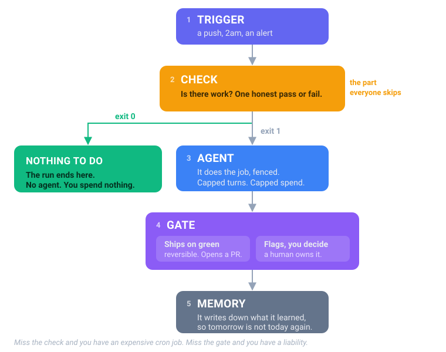

# What a loop is

Five parts. Every loop in this repo is this shape, whatever the job. Change the trigger and the
check; the rest stays the same.

> Miss the check and you have an expensive cron job. Miss the gate and you have a liability.

## Where each part lives in this repo

Open any loop folder, say
[`engineering-loops/loops/02-dependency-upgrades/`](../loop-packs/engineering-loops/loops/02-dependency-upgrades/ORDERS.md),
and you will find the same two files every time.

| Part | The file | What it is |
|---|---|---|
| Trigger | `.github/workflows/loop.yml` | one runner for the whole chapter |
| Check | `loops/NN-name/check.sh` | is there work? |
| Agent | Claude Code or Codex, signed in locally or an API key in CI | capped at $2 and 30 turns |
| Orders | `loops/NN-name/ORDERS.md` | what this loop owns, and must never touch |
| Rules | `CLAUDE.md` / `AGENTS.md` | the rules for the whole chapter, read every run |
| Gate | `ORDERS.md` says which kind | see below |
| Memory | `memory/NN-name.md` | one line per run |

## The check is the whole trick

`check.sh` answers one question and says so with its exit code:

| Exit | Means | What happens |
|---|---|---|
| **0** | no work | The run ends. The agent never wakes. You spend nothing. |
| **1** | there is work | The agent wakes, under the orders. |
| **2** | not wired here | The run fails loudly. The agent still never wakes, and you pay nothing. |

That is why a quiet night is free, and why a check pointed at the wrong folder costs you nothing
instead of costing you tokens.

**The third answer is the one people leave out, and it is expensive.** A check with only two
answers says "there is work" when it really means "I cannot tell". Point sixteen of those at a
repo they were never wired to and you get sixteen agent runs a week, each one waking up, looking
around, and finding nothing. Every check here names what it needs and exits 2 when it is
missing:

    $ bash loops/33-visual-regression-triage/check.sh
    Visual regression triage is not wired to this repo.
    Set LOOP_VISUAL to the command that diffs screenshots against the baseline, for example:
      LOOP_VISUAL='npx playwright test --update-snapshots=none'

Try one:

    cd loop-packs/engineering-loops/demo-app
    bash ../loops/05-dead-code-and-unused-dependency-removal/check.sh
    echo "exit code: $?"

## Two kinds of loop, and only two

Every loop in the catalog is one or the other. Its `ORDERS.md` says which on line three.

**Ships on green.** It opens a PR and merges once the check passes. A bad one is one click back.
Docs sync, dependency upgrades, lint fixes.

**Flags, you decide.** It stops and hands you the call, because it cannot fully certify its own
work or because the action cannot be taken back. Code review, IAM audit, visual regression.

Nothing irreversible happens without a person. That is the whole reason you can walk away.

---

## Enough reading. Go look at one.

| | |
|---|---|
| **Run all four chapters now** | `./run-all-demos.sh` (1 minute, no setup) |
| **Read a real loop's orders** | [loop 2, dependency upgrades](../loop-packs/engineering-loops/loops/02-dependency-upgrades/ORDERS.md) |
| **Browse all 35** | [Engineering](../loop-packs/engineering-loops/LOOPS.md) · [Cloud](../loop-packs/cloud-loops/LOOPS.md) · [AI and ML](../loop-packs/ai-ml-loops/LOOPS.md) · [QA](../loop-packs/qa-loops/LOOPS.md) |

## Is your idea actually a loop?

Before you build one of your own, the guide has a five question test (page 19). The short form:
does it recur and hurt, can it check its own work honestly, can you undo a miss, and is a boring
tool already doing it? Four yeses buy you the right to walk away.

---

[← Read this first](00-start-here.md) · [Contents](../README.md) · [Next: Plain words →](02-plain-words.md)

**The 35 loops:** [Engineering](../loop-packs/engineering-loops/LOOPS.md) · [Cloud](../loop-packs/cloud-loops/LOOPS.md) · [AI and ML](../loop-packs/ai-ml-loops/LOOPS.md) · [QA](../loop-packs/qa-loops/LOOPS.md)
